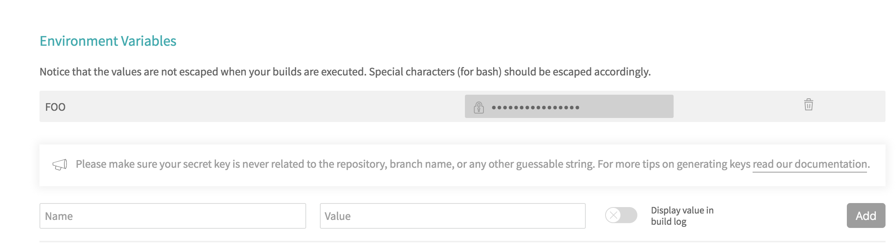

For applications that are developed locally and deployed to multiple server environments (staging, production, etc.), environment variables are essential. Common uses are conditionally executing code based on environment flags or storing base URLs for APIs with matching environments. You may also want to store specific values in environment variables for security reasons -- this is critical in server-side code, but may also be useful on the client-side if you do not want to commit certain values to source code, for example. **But of course, never store secret/sensitive information in client-side code.**

We'll set up your webpack configuration to parse environment variables as globals in your app and go over the steps to implement a **.env** file to define [environment variables locally](#local-environment-variables). Then we'll briefly touch on how you might implement [environment variables on the server](#server-environment-variables).

> #### This guide assumes some stuff
> **You have Node.js and a package manager such as npm or yarn installed.**
>
> **You're using webpack (with or without React).**
>> You can of course define [environment variables in Angular](https://theinfogrid.com/tech/developers/angular/environment-variables-angular/) but the process is a bit different than what is explained below. You can define [environment variables in Vue](https://cli.vuejs.org/guide/mode-and-env.html#using-env-variables-in-client-side-code) as well and even though Vue uses webpack -- it's very **frameworky** about how to do things.
>
> **You're are able to manage your server/deployment configuration.**
>> Whether you're building your app directly on the server or using a CI service such as [Travis CI](https://docs.travis-ci.com/), [Circle CI](https://circleci.com/docs/), or [GitLab CI/CD](https://docs.gitlab.com/ee/ci/), you'll need to know how to set your environment variables per environment.

👍 Let's get into it..

---
## Local environment variables
### Define your variables in a .env file

1. Create a **.env** file **in your project's root directory**.
```bash
touch .env
```
1. Add a `.env` entry to your project's .gitignore file.
```bash{1}
# FILE: /.gitignore
.env # Environment variables for local development.
```
1. Add your environment variables in your **.env** file as key / value pairs, like so:
```bash{1}
# FILE: /.env
# Individual variables
SERVER_ENV=local
MY_API_BASE_URL=https://my-api.com/dev
# If you prefer to use just one environment variable in your config you can
# define a JSON object that you can then parse in your webpack config.
# NOTE: For this to work, the JSON must be formatted this way (inline).
CONFIG_JSON={"server_env": "local", "urls": {"my_api_base_url": "https://my-api.com/dev"}}
```

Since you will not commit your **.env** file to version control, you may want to create another file (which you will commit) called **.env.example** with dummy values just to indicate which variables your application expects. For example:
```bash{1}
# FILE: /.env.example
SERVER_ENV=(environment_here)
MY_API_BASE_URL=(url_here)
CONFIG_JSON={"server_env": "environment_here", "urls": {"my_api_base_url": "url_here"}}
```

When naming your variables, try to be explicit so they don't conflict with other Node variables (like CI built-in variables, ie: [Travis CI](https://docs.travis-ci.com/user/environment-variables/#default-environment-variables), [Circle CI](https://circleci.com/docs/2.0/env-vars/#built-in-environment-variables), and [GitLab CI](https://docs.gitlab.com/ee/ci/variables/#predefined-variables-environment-variables)).

> ⚠️ **If you are using create-react-app (and you have not ejected)**
>> The above should work except for one caveat: **variables defined in your .env file must be prefixed with** `REACT_APP_`  **in order to use them in your app.**
>> See the [create-react-app official docs](https://facebook.github.io/create-react-app/docs/adding-custom-environment-variables) for more info.

If you are working with other developers you'll need to share your **.env** file and make sure changes are updated everywhere.

### Use the variables defined in your .env in your application

1. Install the [dotenv](https://github.com/motdotla/dotenv) node package
```bash
# Install with npm
npm i dotenv
# or with yarn if that's your thing
yarn add dotenv
```
1. Paste this bit of code near the top of your webpack config. The `isCiBuild` bit prevents webpack from unnecessarily requiring dotenv in CI environments.
```js{1}
// FILE: /webpack.config.js
    // We can check if webpack is building in a CI environment because services
    // like Travis CI set default environment variables like "CI".
    const isCiBuild = !!process.env.CI
    if(!isCiBuild) {
      require('dotenv').config()
    }
```
1. Add [DefinePlugin](https://webpack.js.org/plugins/define-plugin/) to your webpack config. *If you're not sure how to add plugins to your webpack config, see the [Plugins](https://webpack.js.org/concepts/plugins/) webpack docs.* This example shows how to assign individual environment variables as well as parsed JSON variables.
```js{1,9-14}
// FILE: /webpack.config.js
    {
      // ... other webpack config stuff
      plugins: [
        // ... other plugins if you have any
        new webpack.DefinePlugin({
          // ... any other global vars
          VERSION: JSON.stringify('1.2.3'), // just an example of a global variable you could add
          // pull in your individual .env vars
          SERVER_ENV: JSON.stringify(process.env.SERVER_ENV),
          MY_API_BASE_URL: JSON.stringify(process.env.MY_API_BASE_URL),
          // OR parse your JSON vars if you used this method
          SERVER_ENV: JSON.stringify(JSON.parse(process.env.CONFIG_JSON).server_env),
          MY_API_BASE_URL: JSON.stringify(JSON.parse(process.env.CONFIG_JSON).urls.my_api_base_url),
        }),
      ]
    }
```
1. Use your new variables in your application.
```js
    console.log(`version: ${VERSION}`) // '1.2.3'
    console.log(`version: ${SERVER_ENV}`) // 'local'
    if (SERVER_ENV !== 'production') {
      // this code will NOT run on production
    } else {
      // this code will run on production
    }
```
*If you're not familiar with the syntax below, check out [my other post](/async-await/) about `async`/`await`*.
```js{3-4}
    const getUsers = async () => {
      try {
        const response = await fetch(`${MY_API_BASE_URL}/users`) // transpiles to fetch('https://my-api.com/dev/users')
        const json = await response.json()
        return json
      } catch (err) {
        console.warn(err)
      }
    }
```
*If all went well* implementing the steps above, we have now configured webpack to use environment variables as global application variables in our webpack build! 🎉


### Bonus - linter globals
You can add your global variables to your **.eslintrc** or **.jshintrc** config file which will allow you to use your globals freely without your linters yelling at you:
```js{1}
// FILE: /.eslintrc or /.jshintrc
{
  // ...
  "globals": {
    "VERSION": true,
    "SERVER_ENV": true,
    "MY_API_BASE_URL": true,
  }
}
```
You can achieve the same thing on a per-file basis if you put a comment at the top of your file like this:
```js
/* globals VERSION, SERVER_ENV, MY_API_BASE_URL */
```

---
## Server environment variables

There are a number of ways to set environment variables and your configuration is going to be unique to your project.

> Whichever method you chose just make sure that **environment variables are set *before* running the webpack build script because webpack will transpile those values into your JS bundle which can then be deployed.**

### Directly on the server

You can install Node.js on each server and set your environment variables via the process global variable like so:
```console
process.env.SERVER_ENV = 'production'
```
or install the [dotenv](https://github.com/motdotla/dotenv) package:
```bash
# Install with npm
npm i dotenv
# or with yarn if that's your thing
yarn add dotenv
```
and manually maintain a **.env** file on each server.

### In your CI service interface

In the project settings of your CI service you'll find a place to add environment variables. For static values this is a great place to store and manage them.

Travis CI | Circle CI | GitLab CI
--- | --- | ---
 |  | 

> **GitLab** is unique in that it allows for *specifying variables for each environment (staging, production, etc)* in the UI and then specify which environment to use for each job in a configuration file.

### In a CI config file

CI services all allow you to write YAML configuration files that provide deployment instructions. You will need to define jobs to run that set environment variables *based on which branch you are pushing to and which server you are deploying to*.

### Use Docker/Kubernetes


*...yet* 😉

---

## 🎉 That's it!

Now that webpack can understand your server configuration and your new local **.env** file, you can use environment variables in your app and easily manage them locally and on your server.


For more info about setting environment variables in other types of client-side apps or to configure CI deployment steps, check out the resources below.

#### Additional resources

- https://12factor.net/config
- https://theinfogrid.com/tech/developers/angular/environment-variables-angular/
- https://cli.vuejs.org/guide/mode-and-env.html#using-env-variables-in-client-side-code
- https://facebook.github.io/create-react-app/docs/adding-custom-environment-variables
- https://brettdewoody.com/secure-environment-variables-with-travis/
- https://circleci.com/docs/2.0/env-vars/
- https://docs.gitlab.com/ee/ci/variables/
